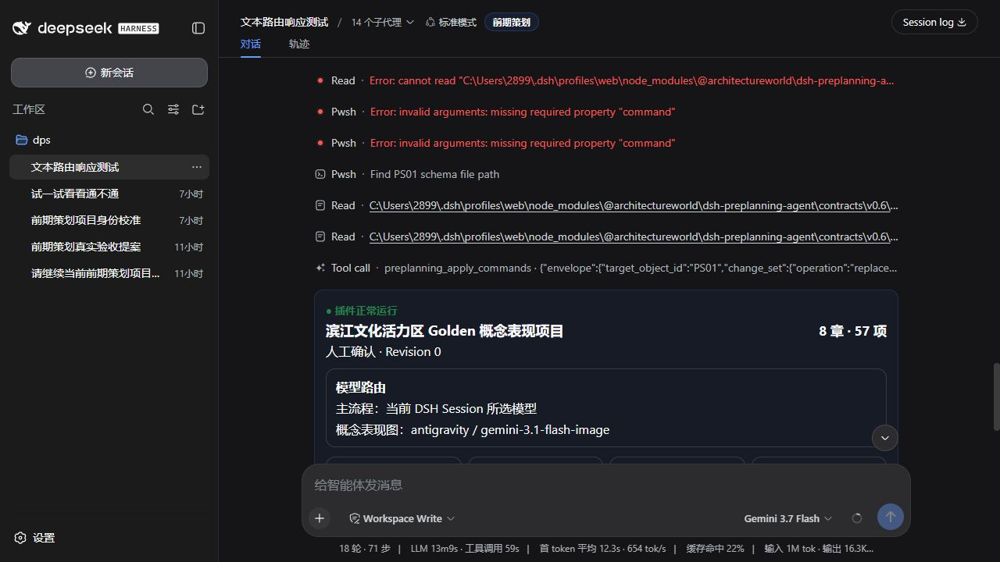

# D3：0.7.0 全流程、双模式与三格式成果验收

日期：2026-08-28（Asia/Shanghai）

## 验收结论

0.7.0 的真实 DSH 插件加载、双模式入口、状态恢复与模型路由均正常；57 项、8 Gate、视觉治理、报告下载路由和三格式报告闭环已由自动化与 Golden 项目证明；HTML、PPTX、PDF 均为真实生成文件并完成视觉检查。

真实 DSH 当前项目尚未完成 57 项，因此本证据不把 Golden 的 Revision 57 状态写回或冒充真实 Session 状态。

## 真实 DSH Host/UI

- DSH：`0.1.1-rc.2`
- 地址：`http://127.0.0.1:3080/`
- 监听进程：Node，验收时 PID `49644`
- 已安装插件：`@architectureworld/dsh-preplanning-agent@0.7.0`
- 页面状态：“● 插件正常运行”
- 项目结构：8 章、57 项
- 当前模式：人工确认
- 主流程模型：继承当前 DSH Session 所选模型
- 生图路由：`antigravity / gemini-3.1-flash-image`
- 创建入口：可选“人工确认”或“全自动完成”
- 恢复状态：11 张 adopted、1 个视觉阻断

截图：

截图上方保留的红色行是该 Session 早期模型参数与路径试验的历史记录，不是 0.7.0 插件加载失败。当前插件状态以同一页面状态卡中的“插件正常运行”和 Profile 已安装版本为准。

## 自动化闭环

串行发布门禁结果：

- 40 个测试文件，97/97 测试通过。
- `pnpm typecheck` 通过。
- `pnpm build` 通过。
- 构建产物回归 2/2 通过。
- `contracts/v0.6` 合同门禁 949/949 通过。
- 下载路由、HTML/PPTX/PDF 三个报告入口和 57 项/8 Gate 完成条件通过自动化覆盖。
- `pnpm golden:build -- --output <目录>` 已从命令行真实执行成功。

## Golden 甲方报告成果

Golden 冻结成果：

- Revision 57
- 57/57 工作项
- 8/8 Gate
- 12 条概念表现视觉记录
- 11 张 adopted
- 1 条旧超时恢复/视觉阻断记录
- 17 张确定性图表

渲染与人工检查：

- PowerPoint 原生渲染 42/42 页完成。
- PPTX 溢出检查通过，G1-G8 决策表完整显示。
- PDF 渲染 64/64 页完成，旧的近空白免责声明尾页已消失。
- 关键联表、决策页、行动页和报告末页已人工检查。
- 客户正文不暴露内部 Workflow ID、状态对象 ID 或 ISO 时间戳。
- G6、G8 以“有条件确认”呈现，图表值为 70%，没有伪装成普通 100% 确认。

成果目录：

`C:\Users\2899\Documents\Codex\2026-08-27\yue-du\outputs\dsh-preplanning-0.7.0\golden-project`

| 格式 | 文件 | SHA-256 |
| --- | --- | --- |
| HTML | `html/index.html` | `E22A5A45B3708F35DEAC7090277C0BAC213C7390EE593BFFF0CA4C37DFC5C5FF` |
| PPTX | `report.pptx` | `C570C9FF922BD36E7172C4569CE138F086D5EF1781CA8B0E69C215519989AEC7` |
| PDF | `report.pdf` | `DAB7D7C6FA02710B373BDF173B7D3DAD674C027A1111E975E72EBE8D50A79730` |

安装包：

- `architectureworld-dsh-preplanning-agent-0.7.0.tgz`
- SHA-256：`0215FB43C9B8404B2A9928020FEED9EC15D57EC700E259FDDB1C3D509776FE8C`

## 限制与停止条件

- 当前真实 DSH 项目为 Revision 0、0/57，尚无报告下载链接。
- Golden 报告证明的是完整发布链路，不是对真实 Session 状态的替换。
- `concept-12` 的第二次尝试因配额阻断，保留恢复记录；为避免无意义消耗，没有继续使用第三次尝试。
- 未修改或删除 Session、Storage、模型设置和凭据。
